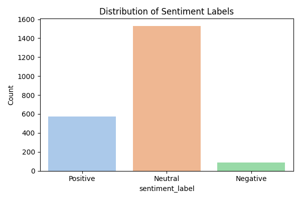
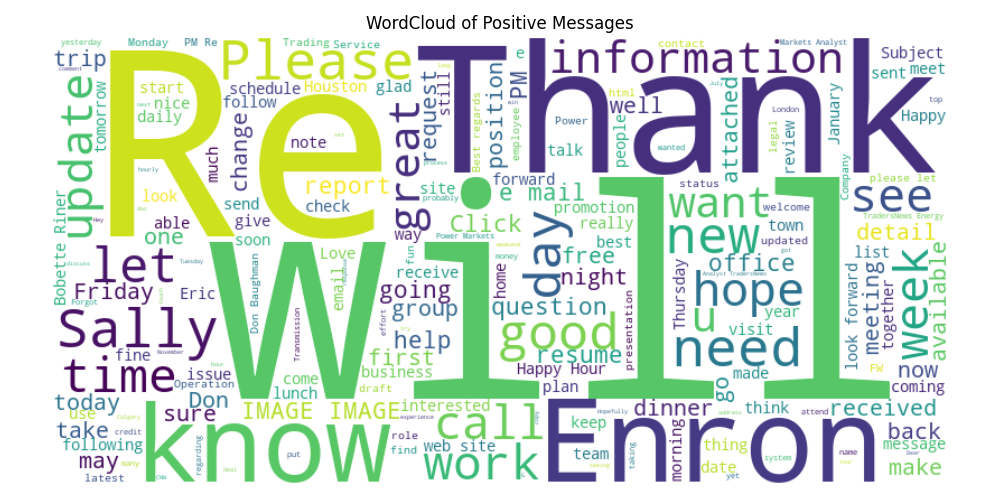
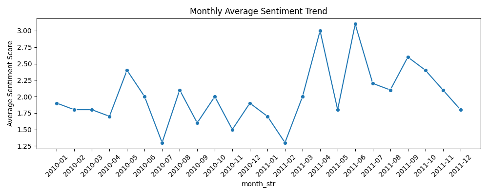
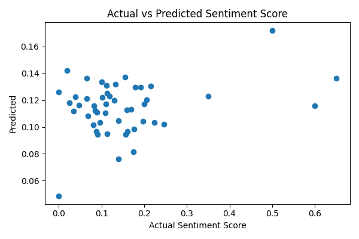

# 🧠 Employee Sentiment Analysis – Final LLM Project

## 📌 Objective

This project analyzes employee emails to extract and understand their sentiment using NLP techniques. The key goals are:

- 📈 **Sentiment Labeling** (Positive, Negative, Neutral)
- 📊 **EDA & Visualizations**
- 🧾 **Monthly Sentiment Scoring**
- 🧑‍💼 **Employee Ranking**
- ⚠️ **Flight Risk Identification**
- 🔮 **Linear Regression Model for Sentiment Trends**

---

## 🗂️ Dataset

- The dataset `test(in).csv` contains the following columns:
  - `Subject`
  - `Body`
  - `Date`
  - `From` (sender email)

---

## 📊 Exploratory Data Analysis (EDA)

### Sentiment Distribution



### WordCloud – Positive Messages



---

## 📈 Monthly Sentiment Trend

Monthly average sentiment score across employees:



---

## 🧑‍💼 Employee Ranking

Each month, the top 3 most positive and most negative employees are ranked using sentiment scores:

- Positive: Score +1
- Neutral: Score 0
- Negative: Score -1

Sorted by:
- Score (descending)
- Alphabetical (ascending)

---

## ⚠️ Flight Risk Detection

> An employee is flagged as a **Flight Risk** if they send **4 or more negative emails within any rolling 30-day period**, regardless of the sentiment score.

All flagged employees are listed in the notebook under `flight_risk_employees`.

---

## 🔮 Predictive Modeling – Linear Regression

A simple linear regression model is used to predict sentiment scores using:

- 📏 Message Length
- 📝 Word Count

### Model Performance Plot



**Evaluation Metrics:**
- R² Score
- MSE

---

## 📂 Project Files

├── test(in).csv
├── Employee_Sentiment_Analysis.ipynb
├── Final_Report.docx
├── README.md
├── visualizations/
│ ├── sentiment_distribution.png
│ ├── positive_wordcloud.png
│ ├── monthly_sentiment_trend.png
│ └── model_performance.png


---

## ✅ Summary

- **Top 3 Positive Employees** and **Top 3 Negative Employees** listed by month
- **Flight Risk Employees** identified based on email sentiment behavior
- All insights supported with charts and EDA

---

## 🚀 How to Run

1. Install required packages:

```bash
pip install pandas matplotlib seaborn textblob scikit-learn wordcloud
python -m textblob.download_corpora

2.  Open Employee_Sentiment_Analysis.ipynb in Jupyter Notebook / VS Code.

3.  Run all cells step-by-step.


👨‍💼 Author
Rushikesh Kadam
Final LLM Assessment – Sentiment Analysis Project
Email: rushikadam1912@gmail.com


